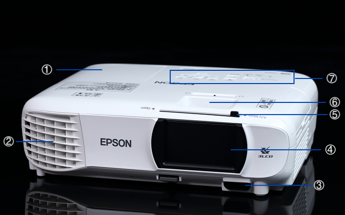
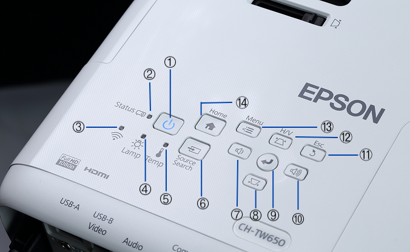
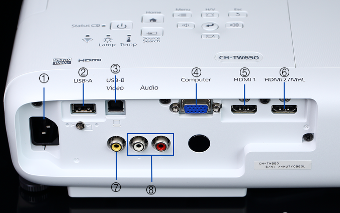
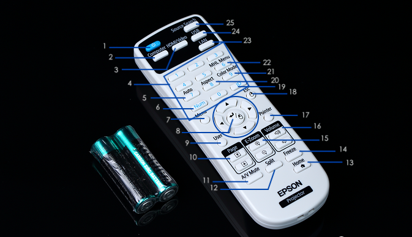

.. projector_sphinx documentation master file, created by
   sphinx-quickstart on Sat Jan  2 09:30:21 2021.
   You can adapt this file completely to your liking, but it should at least
   contain the root `toctree` directive.

部件功能概览
============================================

===  ============  ================================
 \       名称                    功能
===  ============  ================================
1    灯泡盖        更换投影仪内部灯泡时打开该盖。
2    排气口        用于排出冷却投影机内部所用空气。
3    遥控接收器    接受遥控器的信号。
4    镜头          由此处投影图像。
5    滑盖调节杆    滑动以打开和关闭镜头盖。
6    焦距调节划钮  调节图像焦点。
7    控制面板      操作投影仪。
===  ============  ================================

===  ====================  ======================================================================================
 \           名称                                                   功能
===  ====================  ======================================================================================
1    待机按钮(待机指示灯)  打开或关闭投影机。开机状态时亮起蓝色。
2    状态指示灯            闪烁蓝色表示投影机正在暖机或冷却。
3    WiFi指示灯            连上WiFi时亮起蓝色。
4    灯泡指示灯            需要更换灯泡时闪烁橙色。
5    温度指示灯            投影仪内部温度过高时闪烁橙色。
6    Source Search按钮      切换到正在发送图像的下一个输入源。
7    音量减小按钮          调节音量。显示投影机的菜单时选择菜单项目或调整值。显示梯形校正屏幕时执行水平梯形校正。
8    梯形校正按钮(下)      调整投影图像的梯形失真。显示投影机的菜单时选择菜单项目或调整值。
9    Enter按钮             显示菜单时可选择功能和设定。
10   音量增大按钮          调节音量。显示投影机的菜单时选择菜单项目或调整值。显示梯形校正屏幕时执行水平梯形校正。
11   Esc按钮               显示菜单时可返回到上一级菜单。
12   梯形校正按钮(上)      调整投影图像的梯形失真。显示投影机的菜单时选择菜单项目或调整值。
13   Menu按钮              显示和关闭配置菜单。在配置菜单上，可以调节和设定信号、图像、输入信号等。
14   Home按钮              切换到芒果TV输入的图像。
===  ====================  ======================================================================================

===  ================  ============================================================================
 \         名称                                            功能
===  ================  ============================================================================
1    电源插座          连接电源线至投影机。
2    USB-A端口         连接USB存储设备或数码相机，并使用PC Free投影图像。
3    USB-B端口         使用USB线将投影机连接到计算机，并投影计算机上的图像。
4    Computer/VGA端口  输入来自计算机的VGA图像信号及来自其他视频源的分量VGA视频信号。
5    HDMI1端口         从HDMI兼容视频设备及计算机输入视频信号。
6    HDMI2/MHL端口     从HDMI容视频设备及计算机输入视频信号。支持来自智能手机和平板设备的输入信号。
7    Video端口         输入来自视频源的复合视频信号。
8    Audio-L/R端口     输入来自Video端口所连设备的音频。白为左，红为右。
===  ================  ============================================================================

===  ================  =====================================================================================
 \         名称                                                功能
===  ================  =====================================================================================
1    Power按钮         打开或关闭投影机电源。
2    Computer按钮      切换至Computer/VGA端口。
3    HDMI/Video按钮    循环切换至Video和HDMI端口。
4    数字键            用于输入密码。
5    Auto按钮          如果在投影来自Computer端口的模拟RGB信号时按下该按钮，则可以自动优化跟踪、同步和位置。
6    Num按钮           改变投影图像的长宽比。
7    Menu按钮          显示和关闭配置菜单。
8    方向与确认键      选择并确定菜单项目和设定值。
9    User按钮          随机执行在【设定】菜单的【用户按钮】中设置的功能。
10   Page按钮          更改PowerPoint等文件的页码。
11   A/VMute按钮       打开或关闭音频和视频。
12   Split按钮         通过分离投影屏幕同时投影两个图像或正常投影一个图像之间进行图像切换。
13   Home按钮          切换到芒果TV输入的图像。
14   Freeze按钮        暂停或取消暂停图像。
15   E-Zoom按钮        在不改变投影尺寸的情况下放大或缩小图像。
16   Volume按钮        调节音量。
17   Pointer按钮       显示屏幕光标。
18   ESC按钮           结束当前正在使用的某项功能或转到前一级菜单。使用无线鼠标功能时，该按钮用作鼠标右键。
19   ID按钮            按住该按钮并按数字按钮可选择使用遥控器操作的投影机的ID。
20   Aspect按钮        更改图像的长宽比。
21   ColorMode按钮     改变颜色模式。
22   MHLMenu按钮       显示链接到投影机MHL端口的设备的设置菜单。
23   Lan按钮           切换至来自网络连接设备的图像。
24   USB按钮           切换USBDisplay和连接USB-A端口设备的图像。
25   SourceSearch按钮  切换到正在发送图像的下一个输入源。
===  ================  =====================================================================================