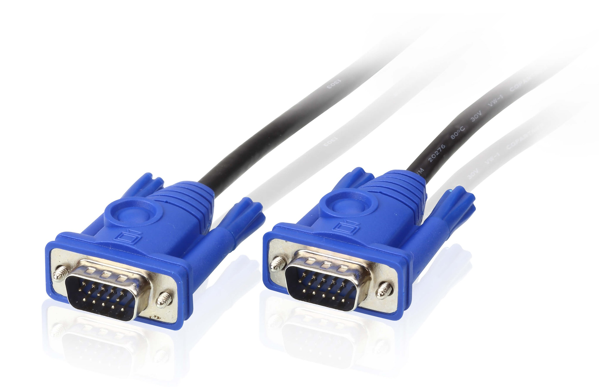

**连接计算机**
#################
要通过计算机投影图像，请使用以下方法连接计算机。

.. attention:: 
 1. 连接前请关闭要连接的计算机，当您将输入源连接到投影仪时如果输入源处于开启状态，则可能会导致故障。
 2. 如果插头的方向或形状不同，请勿强制插入。否则设备可能会受损或出现故障。
  - 投影仪的VGA连接线接入到计算机的VGA接口。
  - 若计算机没有相应的VGA接口，需要配备VGA转换器进行连接。

**VGA接口**
*************
VGA接口是显卡上输出模拟信号的接口，虽然液晶显示器可以直接接收数字信号，但很多低端产品为了与VGA接口显卡相匹配，因而采用VGA接口。VGA接口是一种D型接口，上面共有15针空，分成三排，每排五个。
参考图像如下：

.. image:: images/VGA_charge.jpg
    :height: 100px
    :width: 200 px
    :align: center

**VGA转接头**
**************
在计算机没有VGA接口的情况下，需利用type-c转VGA转换器、USB转VGA转换器或者HDMI转VGA转换器来完成连接投影仪。参考图像如下：

