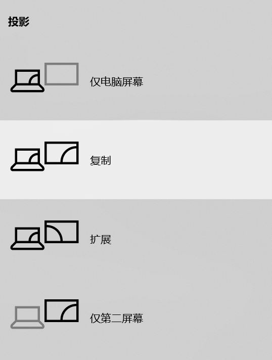

**使用投影仪**
===================

## **使用前** ##

### **放下幕布** ###

    （1）通常幕布已经放下，如果已经放下，跳过这一步。
    （2）如果幕布没有放下，请按下幕布下方的按钮将幕布放下，这个按钮通常在黑板旁边。

### **打开电脑** ###

    （1）确认与电脑连接的VGA线已经插好。
    （2）打开电脑电源。

### **打开投影仪** ###

    （1）按下投影仪遥控器上的电源按钮。
    （2）耐心等待投影仪开机。
    （3）投影仪顶端指示灯亮起，幕布出现投影画面。
> 注意：投影仪使用期间请勿直视投影仪镜头，以免对眼睛造成伤害。

## **使用中** ##
### **切换信号源** ###    
    按下投影仪遥控器上的“source search”按钮，投影仪将自动探测输入信号并切换图像。

### **屏幕切换** ### 
    对于WIN10系统，按下WIN+P键将出现下图，选择“复制”即可完成屏幕切换。

### **播放PPT** ### 
播放PPT中可能用到的实用功能:
#### **A/V Mute** ####

  
不想让观看者看到电脑上的某些操作或画面时，暂时关掉屏幕和声音。

  

    （1）按下遥控器上的“A/V Mute”按钮，暂时隐藏屏幕画面和声音。
    （2）再次按下“A/V Mute”按钮，恢复画面和声音。
  

#### **Freeze** ####

  
需要在计算机中进行切换文件等操作时，使屏幕上的图像静止保持在当前界面，但不会暂停声音的播放。

  

  

    （1）按下遥控器上的“Freeze”按钮，屏幕将开始静止。
    （2）再次按下“Freeze”按钮，屏幕将恢复到当前界面。
  

## **使用后** ##
### **关闭投影仪** ### 
    按下遥控器上的电源按钮，再次按下即确认关机。

### **断开连接** ### 
    将与电脑端连接的VGA线插头拔出，使用结束。
